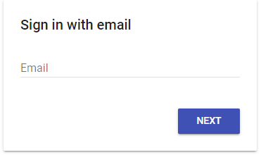
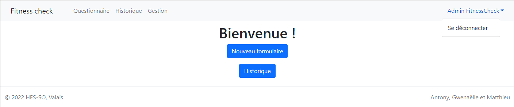
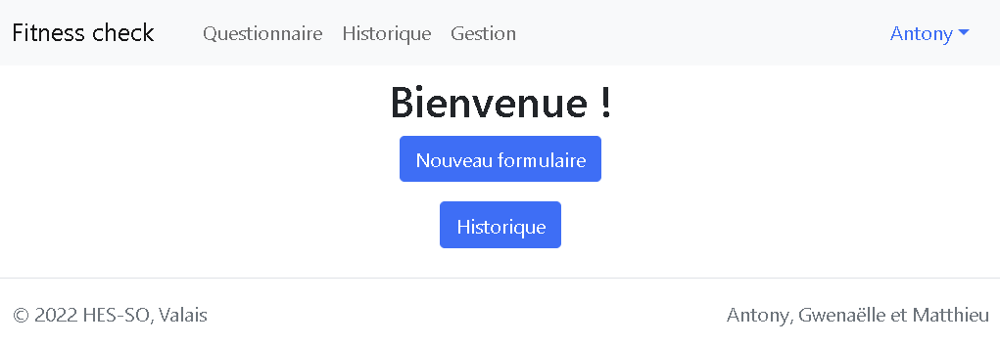
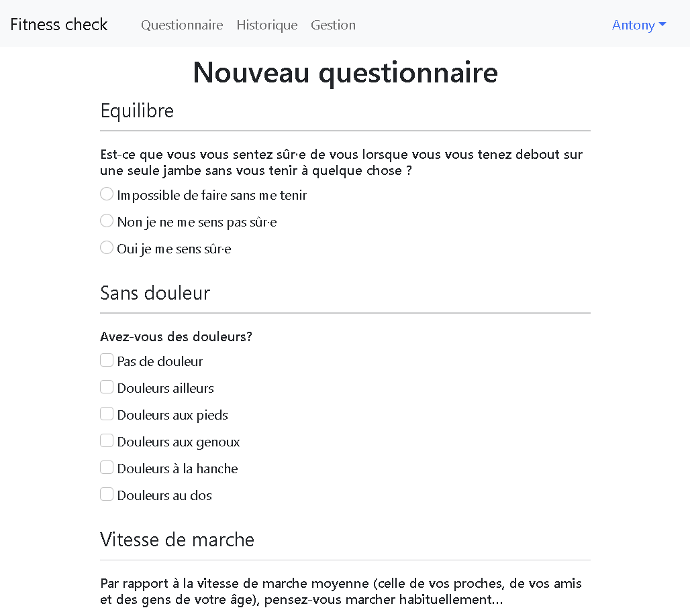
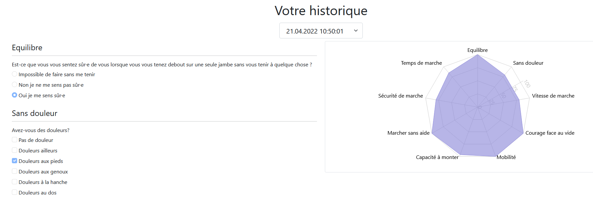
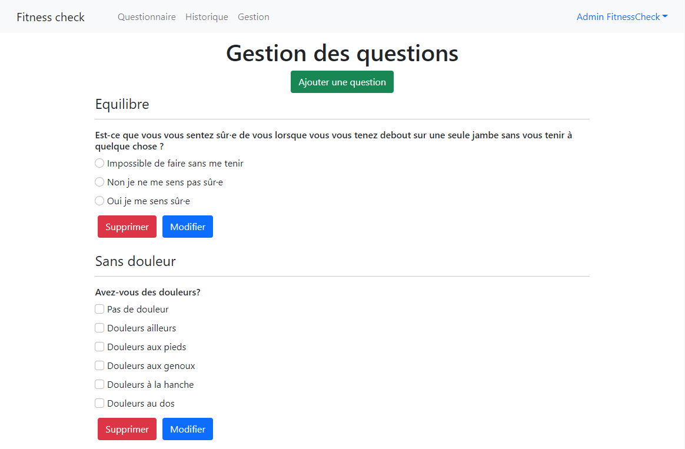
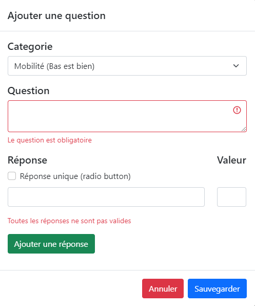

# User guide
## Introduction
The application has been created for the optional module 645-1 of the [HES-SO Valais Wallis](http://www.hevs.ch/).
We were asked to create a React JS application based on a [fitness Excel form](attachments/Questions_fitnessCheck.xlsx).

The requirements are :
- Questionnaire for radar plot
- Diagram radar plot
- Firebase login
- History in Firebase

We decided to add some more functionalities :
- Storing all the information in Firestore (No hard code principle)
- Manage the form by adding, editing and deleting questions

The application is deployed on : [https://grp11.p645.hevs.ch/](https://grp11.p645.hevs.ch/)

## Navigation
There exist different routes where you can navigate to :
- `/` : Redirect to Home page
- `/form` : Redirect to new Form page
- `/history` : Redirect to Historic forms page
- `/admin` : Redirect to Form Management page
- Any other routes : Redirect to Home page

## Login
- If you are not logged, you will be redirect to login.

- Enter your email:
  - If you have already an account, it will ask your password
  - If not, you have to create an account: enter your name and a password

You can log off in top right menu by clicking on your name:

## Home
From the home page, you can navigate 
- To a new form
- To your history

## Form
Navigating to `/form` allows you to fill in a new form concerning your fitness health.

Questions are sorted by category and order alphabetically.
 Each question allows either a unique answer or multiple ones.
 All questions need to be completed in order to submit the form.

## History
When a form is completed, or via the "historique" link, the page shows all the answers of a selected form.
There is in addition the chart who shows graphically the results in each category.

The original chart has been slightly modified in order to have a "bigger is better" chart.
Originally there were two categories which were inverted. We also changed the names to match this difference.

## Form management
With an admin account, you can edit the form on this page. (Contact us if you need an admin account)

- If you edit a question, form already completed won't be impacted.
- You can't edit the scale of a category, but you have this information in the category field.
- You have the complete all field.
- Question must have at least one answer.

