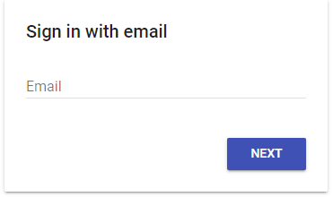
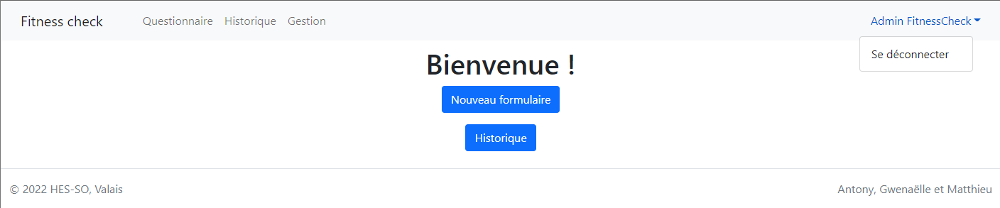
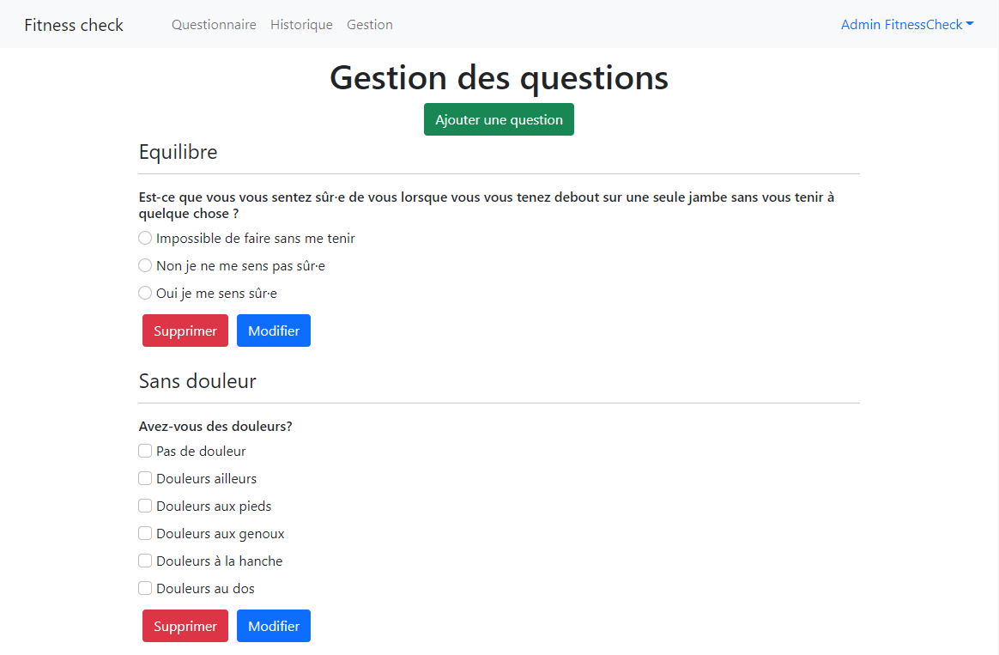
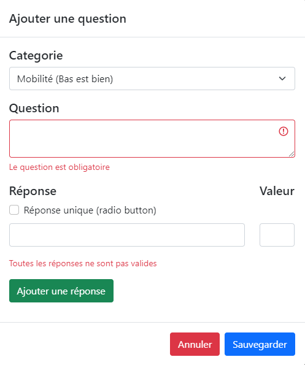

# User guide
## Introduction
- What does the application ?

## Navigation
There exist different routes where you can navigate to :
- `/` : Redirect to Home page
- `/form` : Redirect to new Form page
- `/history` : Redirect to Historic forms page
- `/admin` : Redirect to Form Management page
- Any other routes : Redirect to Home page

## Login
- If you are not logged, you will be redirect to login.

- Enter your email:
  - If you have already an account, it will ask your password
  - If not, you have to create an account: enter your name and a password

You can log off in top right menu by clicking on your name:

## Home

## Form

## History

## Form management
With an admin account, you can edit the form on this page. (Contact us if you need an admin account)

- If you edit a question, form already completed won't be impacted.
- You can't edit the scale of a category, but you have this information in the category field.
- You have the complete all field.
- Question must have at least one answer.

